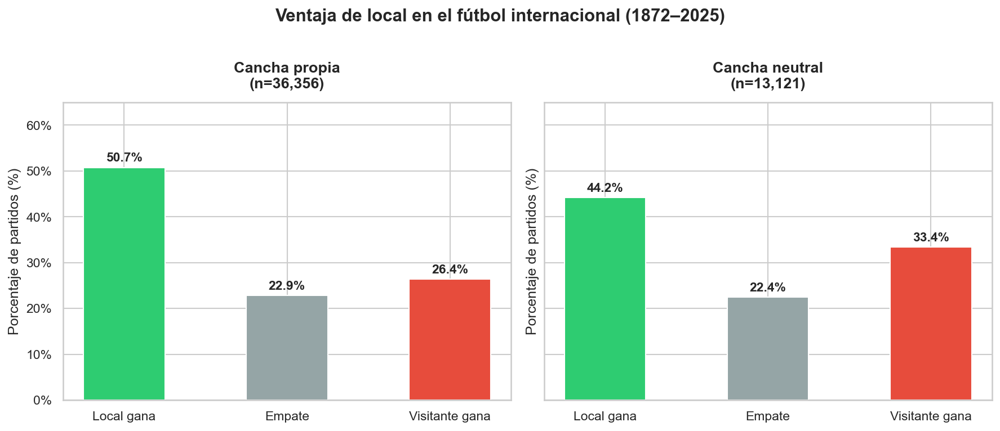
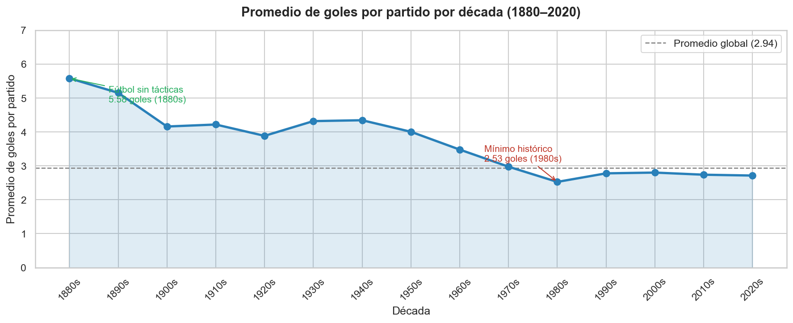
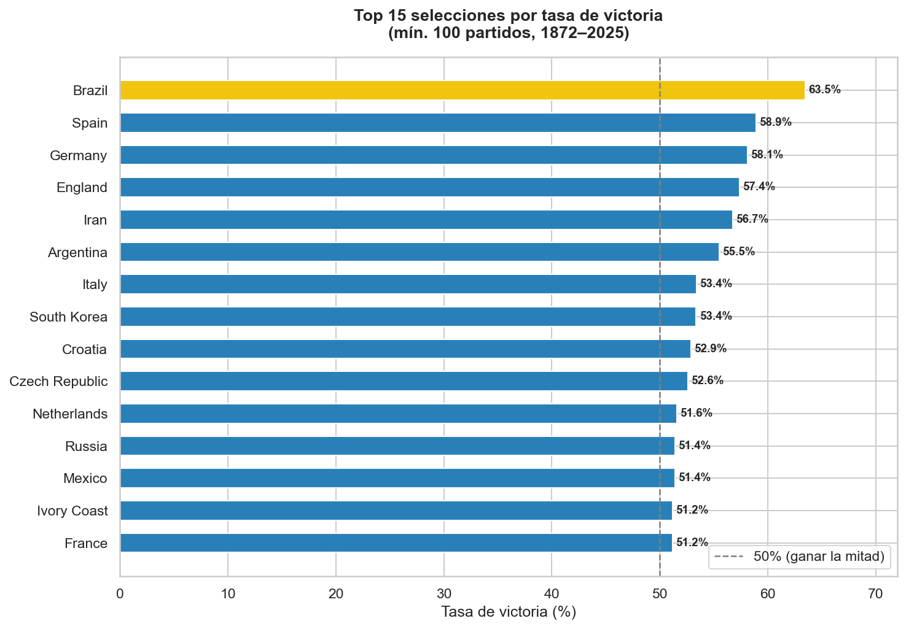
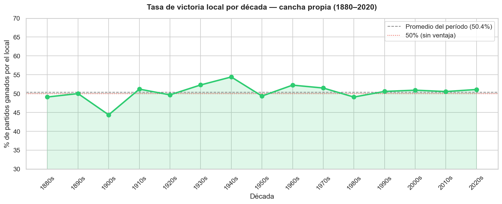
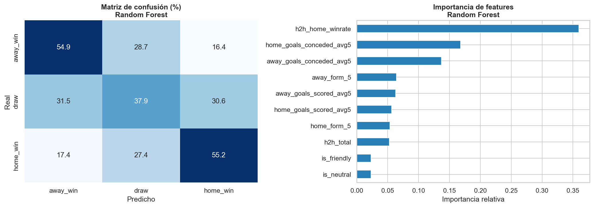

# ⚽ International Football Analytics

Análisis exploratorio y modelo predictivo sobre **153 años de fútbol internacional** (1872–2026), usando un dataset de 49,000+ partidos que cubre Copas del Mundo, Copa América, Eurocopa, eliminatorias y amistosos.

## Estructura del proyecto

```
football-analytics/
├── data/
│   ├── raw/          # Datos originales descargados (no versionados en Git)
│   └── processed/    # Datos limpios y features generados por este proyecto
├── notebooks/
│   ├── 01_exploracion_inicial.ipynb      # Carga, diagnóstico y limpieza base
│   ├── 02_analisis_exploratorio.ipynb    # Análisis y visualizaciones (Capa A)
│   ├── 03_feature_engineering.ipynb      # Construcción de variables predictivas
│   └── 04_modelo_predictivo.ipynb        # Modelo baseline y Random Forest (Capa B)
├── reports/
│   └── figures/      # Visualizaciones exportadas
└── requirements.txt
```

## Cómo reproducir

```bash
# 1. Clonar el repositorio
git clone https://github.com/AngelASAP107/football-analytics.git
cd football-analytics

# 2. Crear entorno virtual e instalar dependencias
python3 -m venv venv
source venv/bin/activate
pip install -r requirements.txt

# 3. Descargar los datos (requiere cuenta en Kaggle y API key configurada)
kaggle datasets download martj42/international-football-results-from-1872-to-2017 \
  --unzip -p data/raw/

# 4. Ejecutar los notebooks en orden
jupyter notebook
```

> Los datos **no están versionados en Git**. Descárgalos siguiendo las instrucciones de arriba.

## Dataset

| Archivo | Descripción |
|---|---|
| `results.csv` | 49,000+ partidos internacionales (1872–2026) |
| `goalscorers.csv` | Goleadores por partido |
| `shootouts.csv` | Resultados de definiciones por penales |
| `former_names.csv` | Mapeo de nombres históricos de selecciones |

**Fuente:** [martj42 en Kaggle](https://www.kaggle.com/datasets/martj42/international-football-results-from-1872-to-2017) — dataset actualizado automáticamente desde GitHub.  
**Descarga:** junio 2026

---

## Capa A — Análisis Exploratorio

### ¿Cuánto vale ser local?

En 153 años de fútbol internacional, jugar en cancha propia vale aproximadamente **6.5 puntos porcentuales** de ventaja en tasa de victoria. El efecto más visible no es que el local gane más empates, sino que el visitante pierde menos cuando la cancha es neutral (26.4% → 33.4%).



---

### ¿Cómo evolucionaron los goles por partido?

El fútbol del siglo XIX era otro deporte: **5.58 goles por partido** en los 1880s, más del doble que hoy. La tendencia descendente es constante hasta el **mínimo histórico en los 1980s (2.53 goles)**, la era más defensiva del fútbol moderno. La leve recuperación en los 1990s coincide con el cambio de regla del pase hacia atrás (1992). Desde 2000 el promedio se estabiliza alrededor de **2.7 goles**.



---

### ¿Qué selecciones dominan históricamente?

Ranking por tasa de victoria considerando solo selecciones con mínimo 100 partidos. Se excluyeron territorios de confederaciones menores (CONIFA, OFC) cuya alta tasa refleja la debilidad de sus rivales, no su nivel real.



Brasil lidera con **63.5%** de tasa de victoria en 1,062 partidos. Irán en el top 5 (56.7%) es el hallazgo menos esperado — refleja una hegemonía regional en Asia que pocas personas asocian con esa selección.

---

### ¿Ha disminuido la ventaja local con el tiempo?

No. La tasa de victoria local oscila entre 44% y 54% durante 150 años **sin tendencia clara a la baja**, incluso en la era moderna con viajes cómodos y preparación profesional. La ventaja local es estructural y persistente.



---

## Capa B — Modelo Predictivo

### Objetivo

Predecir el resultado de un partido (`home_win`, `draw`, `away_win`) a partir de features construidas con historial previo de cada equipo.

### Features

| Feature | Descripción |
|---|---|
| `is_neutral` | 1 si la cancha es neutral |
| `is_friendly` | 1 si es amistoso |
| `home_form_5` | Tasa de victoria local en últimos 5 partidos |
| `away_form_5` | Tasa de victoria visitante en últimos 5 partidos |
| `home/away_goals_scored_avg5` | Promedio de goles anotados (últimos 5) |
| `home/away_goals_conceded_avg5` | Promedio de goles recibidos (últimos 5) |
| `h2h_total` | Partidos jugados entre estos dos equipos antes de este |
| `h2h_home_winrate` | Tasa histórica de victoria del local contra este rival |

**Regla anti-leakage:** todas las features rolling usan `shift(1)` — el resultado de cada partido solo está disponible para el cálculo del partido siguiente.

### Evaluación

División cronológica: entrenamiento con partidos hasta marzo 2016, evaluación con los últimos 10 años (2016–2026).

Se usa **F1-score macro** como métrica principal en lugar de accuracy, porque el dataset está desbalanceado (49% home_win). Un modelo que siempre prediga `home_win` tendría 49% de accuracy sin aprender nada.

| Modelo | Macro F1 | Accuracy |
|---|---|---|
| Baseline (siempre home_win) | 0.215 | 0.48 |
| Random Forest | **0.490** | **0.51** |



**Hallazgo:** `h2h_home_winrate` es la feature más importante por amplio margen — el historial directo entre dos equipos predice mejor el resultado que la forma reciente de cada uno por separado.

**Limitación honesta:** con 10 features simples, 51% de accuracy y F1 macro de 0.49 es un resultado respetable. Las casas de apuestas profesionales con modelos mucho más complejos apenas superan el 55–60%.

---

## Tecnologías


## Estado del proyecto

- [x] Etapa 1 — Setup de entorno, estructura y descarga de datos
- [x] Etapa 2 — Limpieza y exploración inicial
- [x] Etapa 3 — Análisis exploratorio (Capa A)
- [x] Etapa 4 — Feature engineering
- [x] Etapa 5 — Modelo predictivo (Capa B)
- [x] Etapa 6 — README final con hallazgos y visualizaciones
